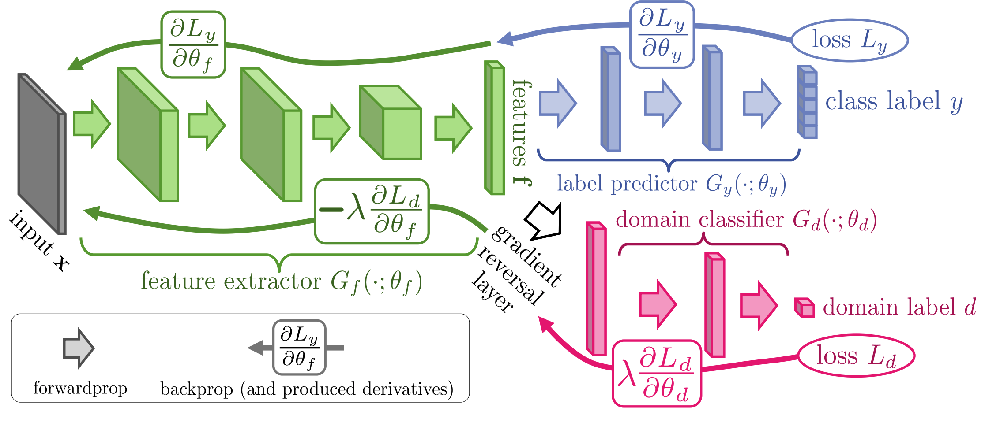

- [Domain-Adversarial Training of Neural Networks](https://dl.acm.org/ doi/abs/10.5555/2946645.2946704) (ganin et al. 16) - want repr. to be invariant to domain label
  - 
- domain adatation given multiple training groups
  - [group](http://papers.neurips.cc/paper/3019-mixture-regression-for-covariate-shift.pdf) [distributionally robust](https://arxiv.org/abs/1611.02041) [optimization](https://arxiv.org/abs/1911.08731)
  - [domain](https://papers.nips.cc/paper/4312-generalizing-from-several-related-classification-tasks-to-a-new-unlabeled-sample) [generalization](https://arxiv.org/abs/2007.01434)
  - 
- domain adaptation using source/target given all at once
  - [importance weighting](https://citeseerx.ist.psu.edu/viewdoc/download?doi=10.1.1.370.4921&rep=rep1&type=pdf)
  - learning [invariant represetntations](https://arxiv.org/abs/1702.05464)
- test-time adaptation
  - [batch normalization](https://arxiv.org/abs/1603.04779)
  - [label shift estimation](https://arxiv.org/abs/1802.03916)
  - [rotation prediction](https://arxiv.org/abs/1909.13231)
  - [entropy minimization](https://arxiv.org/abs/2006.10726)
- [adaptive risk minimization](https://arxiv.org/abs/2007.02931) - combines groups at training time + batches at test-time
  - *meta-train* the model using simulated distribution shifts, which is enabled by the training groups, such that it exhibits strong *post-adaptation* performance on each shift